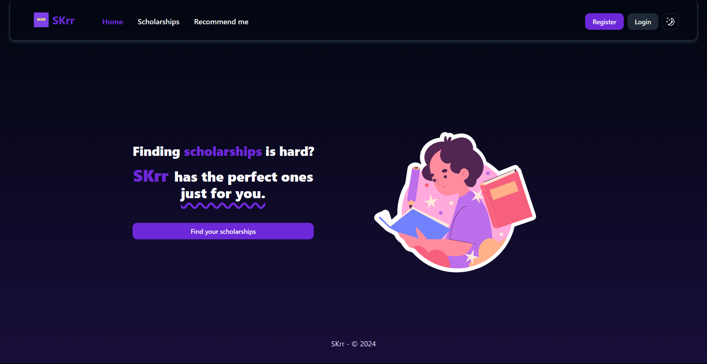
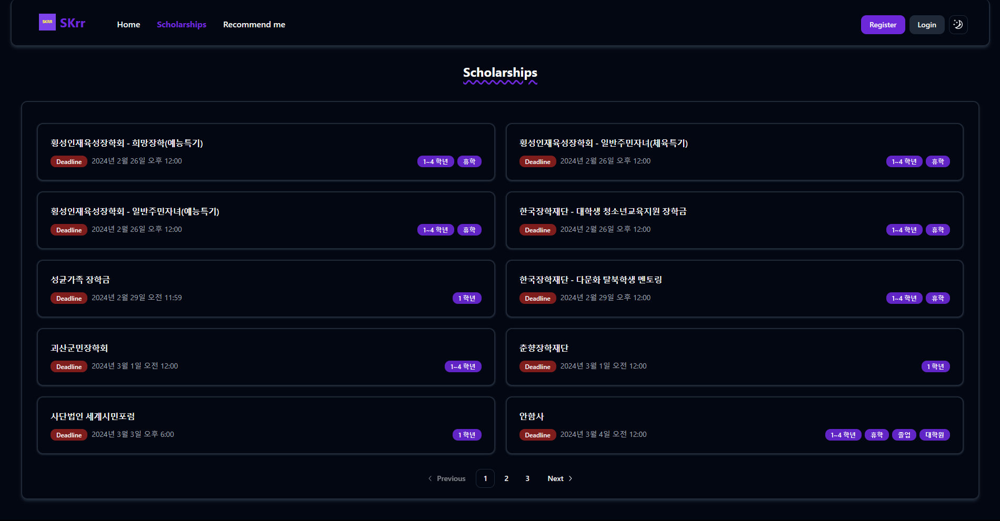
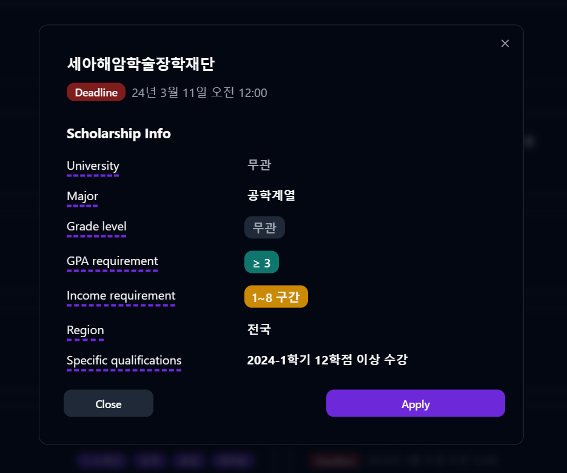
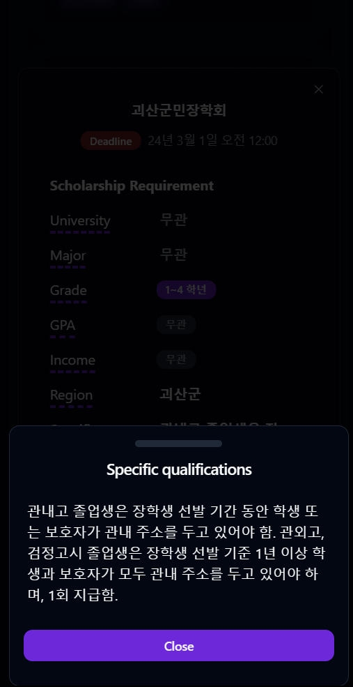
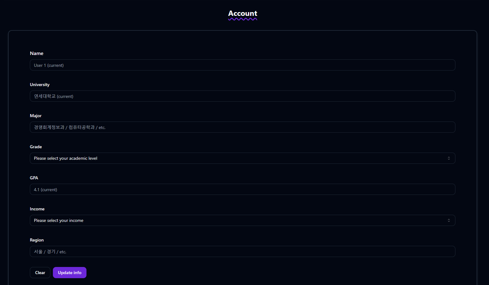

# Skrr - Scholarship recommendation service

The site is hosted on [skrr-skku.vercel.app](https://skrr-skku.vercel.app/).

## Table of contents
- [Built with](#built-with)
  - [Frontend](#frontend)
  - [Backend](#backend)
- [Features](#features)
  - [Scholarships](#scholarships)
  - [Recommend me](#recommend-me)
  - [Account](#account)
- [Author](#author)

## Built with

### Frontend
- **[SvelteKit](https://kit.svelte.dev/)**
- **[Tailwind](https://tailwindcss.com/)** - Styling
- **[Vercel](https://vercel.com/)** - Website deploying

### Backend
- **[Pocketbase](https://pocketbase.io/)** - Database, Auth
- **[Pockethost](https://pockethost.io/)** - Database hosting

## Features

### Scholarships

List all available scholarships, user can also use `search params` to find scholarships with more specific requirements.

For example, [skrr-skku.vercel.app/scholarships?income=2&gpa=2.8&grade=1](https://skrr-skku.vercel.app/scholarships?income=2&gpa=2.8&grade=1) will display scholarships with requirements that contains level 2 income, minimum GPA is lower than 2.8, and eligible for freshmen.

`Pagination` is also implemented

### Recommend me

Similar to `Scholarships page` but this use user account's information to search for suitable scholarships with extra search fields: universities, major, regions.

When user select a scholarship, a card will pop up displaying more information about the scholarship. The user can then click `Apply` button to direct to the application website.

In mobile, the specific requirements might be too long, a drawer will be shown when user click on the text.

### Account

- **Login / Register**

The auth was handled by PocketBase's built-in feature.

- **Update user's information**

## Author

Built by [Tien Trinh](https://tientrinh.netlify.app/)
